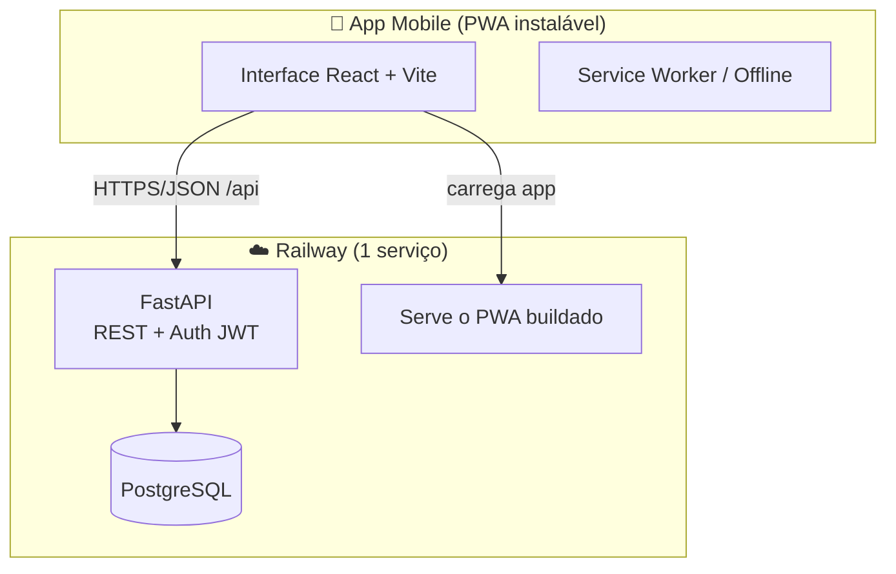
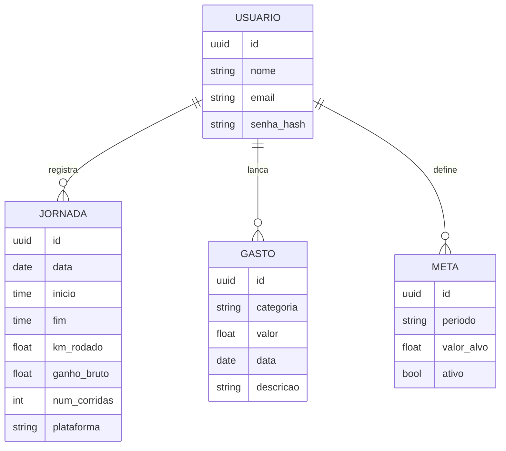
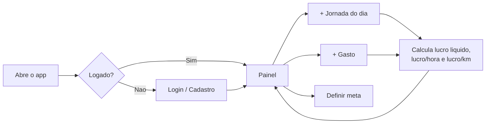
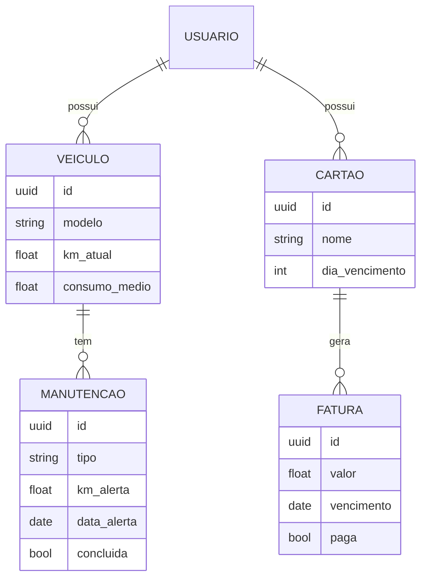

# Arquitetura — Volante

## Visão geral

```mermaid
graph TB
    subgraph Mobile["📱 App Mobile (PWA instalável)"]
        UI[Interface React + Vite]
        SW[Service Worker / Offline]
    end

    subgraph Railway["☁️ Railway (1 serviço)"]
        API[FastAPI<br/>REST + Auth JWT]
        Static[Serve o PWA buildado]
        DB[(PostgreSQL)]
    end

    UI -->|HTTPS/JSON /api| API
    UI -->|carrega app| Static
    API --> DB
```

## Modelo de dados (MVP)

```mermaid
erDiagram
    USUARIO ||--o{ JORNADA : registra
    USUARIO ||--o{ GASTO : lanca
    USUARIO ||--o{ META : define

    USUARIO {
        uuid id
        string nome
        string email
        string senha_hash
    }
    JORNADA {
        uuid id
        date data
        time inicio
        time fim
        float km_rodado
        float ganho_bruto
        int num_corridas
        string plataforma
    }
    GASTO {
        uuid id
        string categoria
        float valor
        date data
        string descricao
    }
    META {
        uuid id
        string periodo
        float valor_alvo
        bool ativo
    }
```

## Fluxo de uso

```mermaid
flowchart LR
    A[Abre o app] --> B{Logado?}
    B -->|Nao| C[Login / Cadastro]
    B -->|Sim| D[Painel]
    C --> D
    D --> E[+ Jornada do dia]
    D --> F[+ Gasto]
    D --> G[Definir meta]
    E --> H[Calcula lucro liquido,<br/>lucro/hora e lucro/km]
    F --> H
    H --> D
```

## Roadmap de dados (fases futuras)

```mermaid
erDiagram
    USUARIO ||--o{ VEICULO : possui
    USUARIO ||--o{ CARTAO : possui
    VEICULO ||--o{ MANUTENCAO : tem
    CARTAO ||--o{ FATURA : gera

    VEICULO {
        uuid id
        string modelo
        float km_atual
        float consumo_medio
    }
    MANUTENCAO {
        uuid id
        string tipo
        float km_alerta
        date data_alerta
        bool concluida
    }
    CARTAO {
        uuid id
        string nome
        int dia_vencimento
    }
    FATURA {
        uuid id
        float valor
        date vencimento
        bool paga
    }
```
